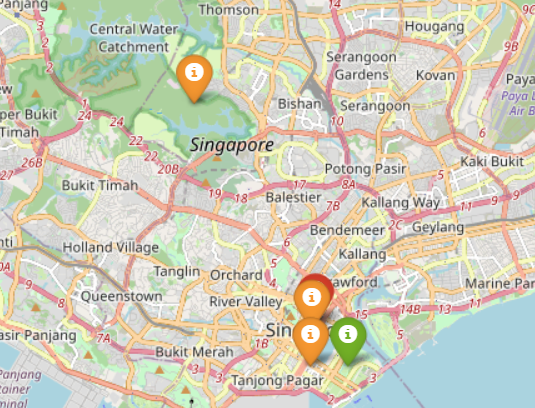
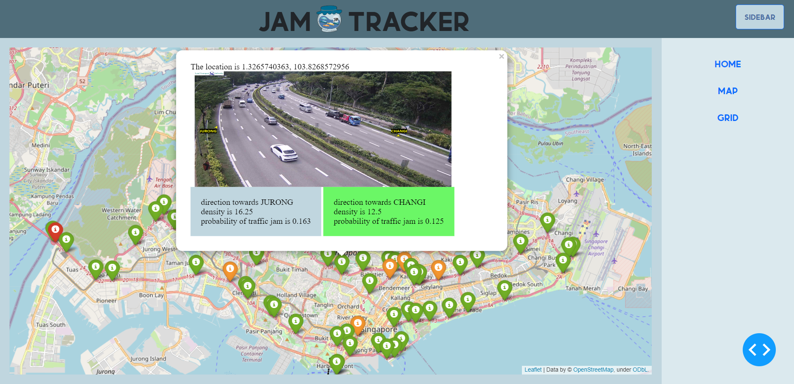
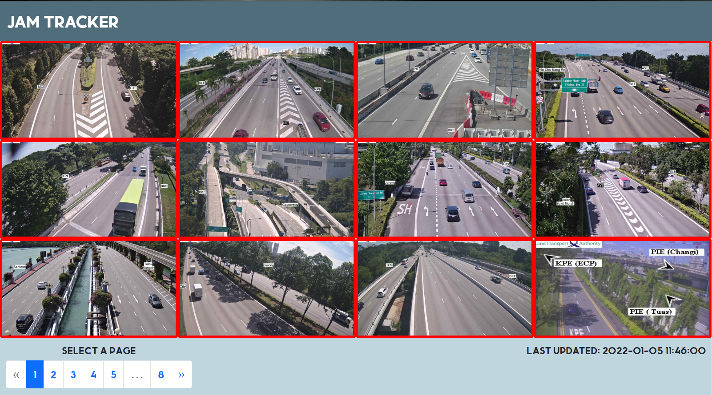
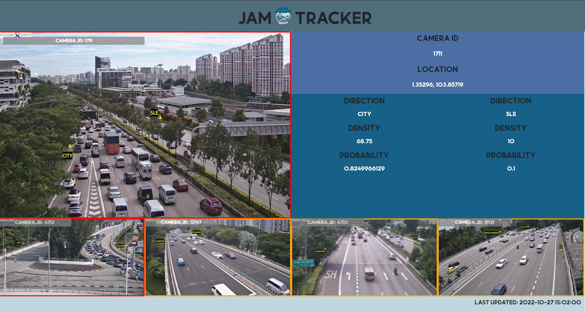

# Frontend Documentation

## Current issue known
```requests.exceptions.ConnectionError: HTTPConnectionPool(host='localhost', port=5000)```

## How to run
To run the docker containers, run the following command from frontend folder:

```docker compose up -d```

The application will be hosted on ```http://127.0.0.1:8050/```

## architecture of the system
There are a total of 4 containers running in the system.

1. flask-model
- APIs to retrieve the data output from the prediction model trained by the backend, which return the predictions and relevant informations of the traffic conditions of the roads

2. result-gen
- Calls the APIs from flask-model every 3 minutes and store the numeric and word data in a separate redis database
- Downloads images using the links to camera image from LTA as links from LTA expires every 5 mins
- Images are downloaded to a shared volume to share the images across docker containers

3. redis-cache
- redis database to store the data return from result-gen after the API calls
- always store the latest data

4. dash-app
- main container for the front-end application
- queries redis-cache for latest data every 3 minutes and update dcc.store to share the latest data across all pages in the application
- retrieve and display the images store in the volumes shared across containers

## File Descriptions

### app.py
- main driver script for the application
- callbacks based on intervals to query redis database for the latest result and update dcc.store with the latest data
- dcc.store store the data and is shared scross the application

### src/result_generator/result_generator.py
- calls the API from backend and  every 3 minutes
- store data retrieve in redis database

## Application Descriptions

**home page**
- contains introduction to the model used and the other pages

**map page**
- interactive Singapore map made by folium library
- colour-coded markers to represent the probabilty of having traffic jam
- red, orange and green markers represent high, medium and low probability of having traffic jam respectively



After clicking on the marker, a popup with the details,image and predictions of the location will be shown.



**grid page**
- each page consist of maximum 12 grids
- display camera image on each grid
- colour-coded borders around the grid to represent the probabilty of having traffic jam



After clicking on the grid, a new page with the details, image and predictions of the location will be shown. The top 4 in probability of traffic jam from the remaining grids will also be shown.

