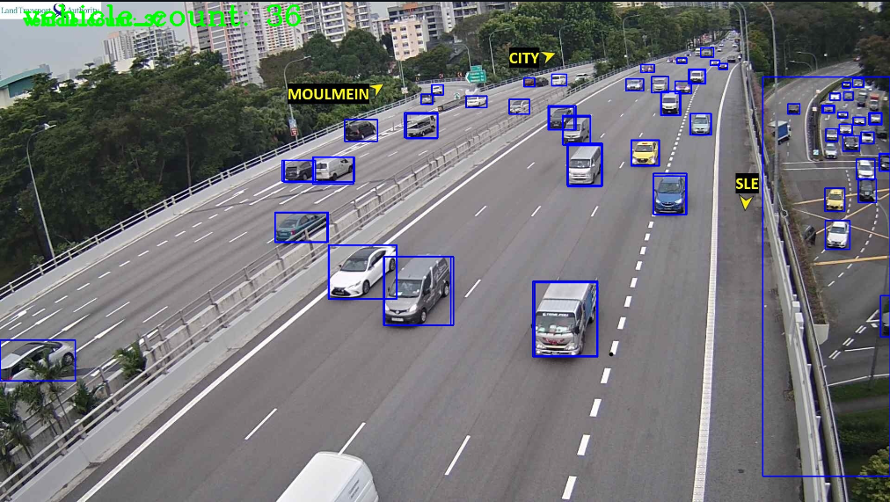

# Frontend Documentation


Frontend application will be hosted on ```http://127.0.0.1:8050/```

## ARCHITECTURE OF THE SYSTEM

There are a total of 4 containers running in the system.

1.[flask-model](../backend/)

- APIs to retrieve the data output from the prediction model trained by the backend, which return the predictions and relevant informations of the traffic conditions of the roads
- NOTE: TO BE RENAMED TO FASTAPI-model instead since the API now runs on FASTAPI instead of FLASK

2.[result-gen](./src/result_generator/)

- Calls the APIs from flask-model every minute and store the numeric and word data in a separate redis database
- Downloads images using the links to camera image from LTA as links from LTA expires every 5 mins
- Images are downloaded to a shared volume to share the images to the dash-app container

3.redis-cache

- redis database to store the data return from result-gen after the API calls
- always store the latest data

4.[dash-app](./src/)

- main container for the front-end application
- queries redis-cache for latest data every minute and update dcc.store to share the latest data across all pages in the application
- retrieve and display the images store in the volumes shared across containers

## FILES DESCRIPTIONS

### [app.py](src/app.py)

- main driver script for the application
- callbacks based on intervals to query redis database for the latest result and update dcc.store with the latest data
- dcc.store store the data and is shared across the application

### [result_generator.py](src/result_generator/result_generator.py)

- calls the API from backend and every minute
- store data retrieved in redis database under key "currDisplay"

## Application Descriptions

### Home page

- contains introduction to the model used and the other pages



### Map page

- interactive Singapore map made by folium library
- colour-coded markers to represent the probabilty of having traffic jam
- red, orange and green markers represent high, medium and low probability of having traffic jam respectively


After clicking on the marker, a popup with the details,image and predictions of the location will be shown.


### Grid page

- each page consist of maximum 12 grids
- display camera image on each grid
- colour-coded borders around the grid to represent the probabilty of having traffic jam


After clicking on the grid, a new page with the details, image and predictions of the location will be shown. The top 4 in probability of traffic jam from the remaining grids will also be shown.


